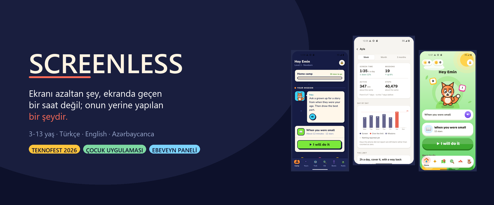
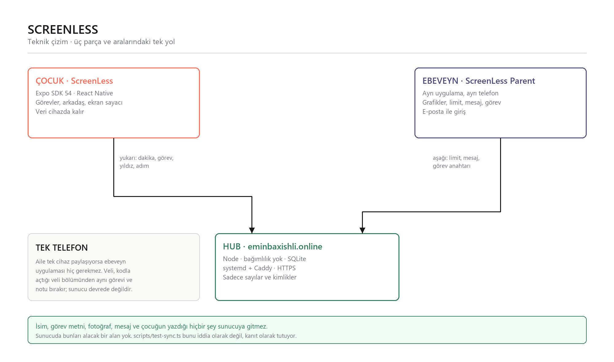
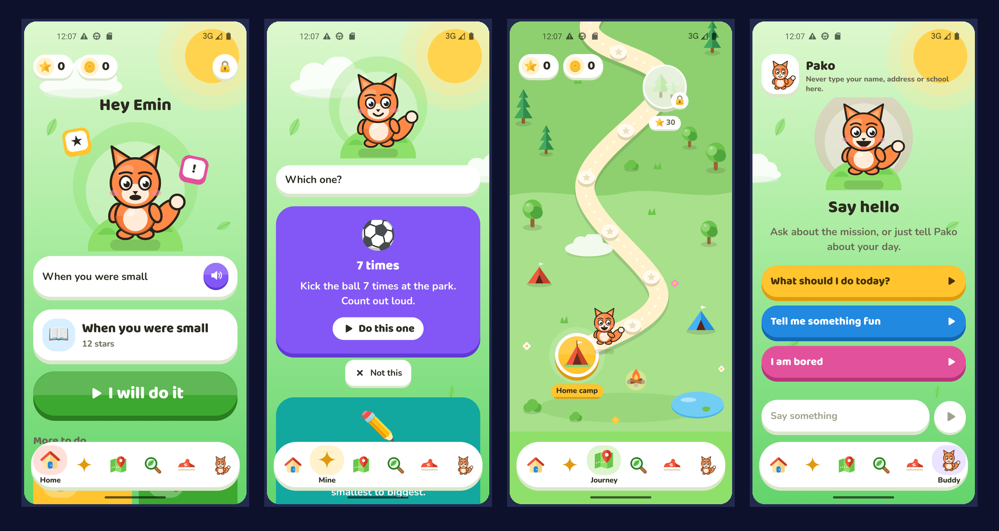
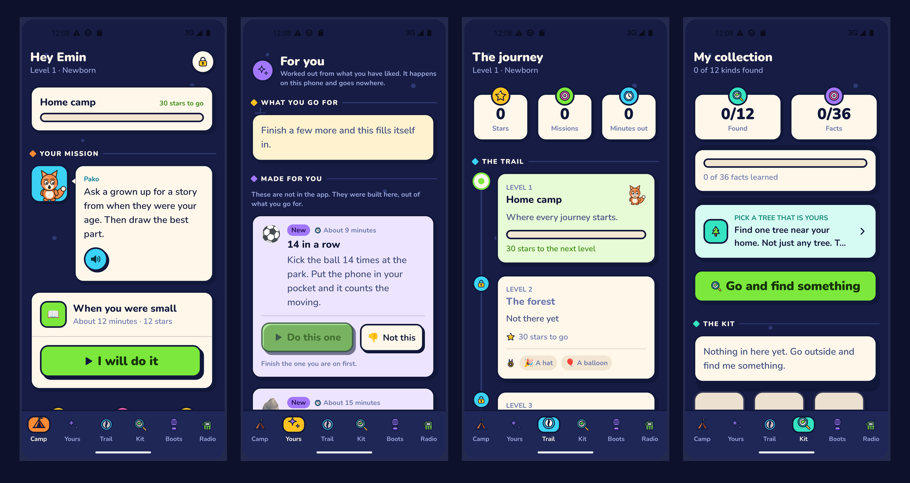
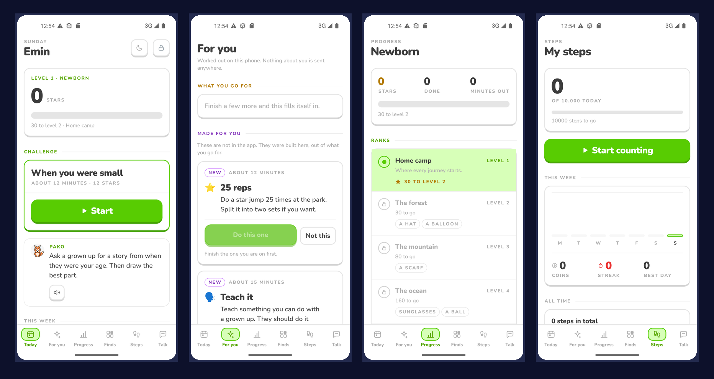
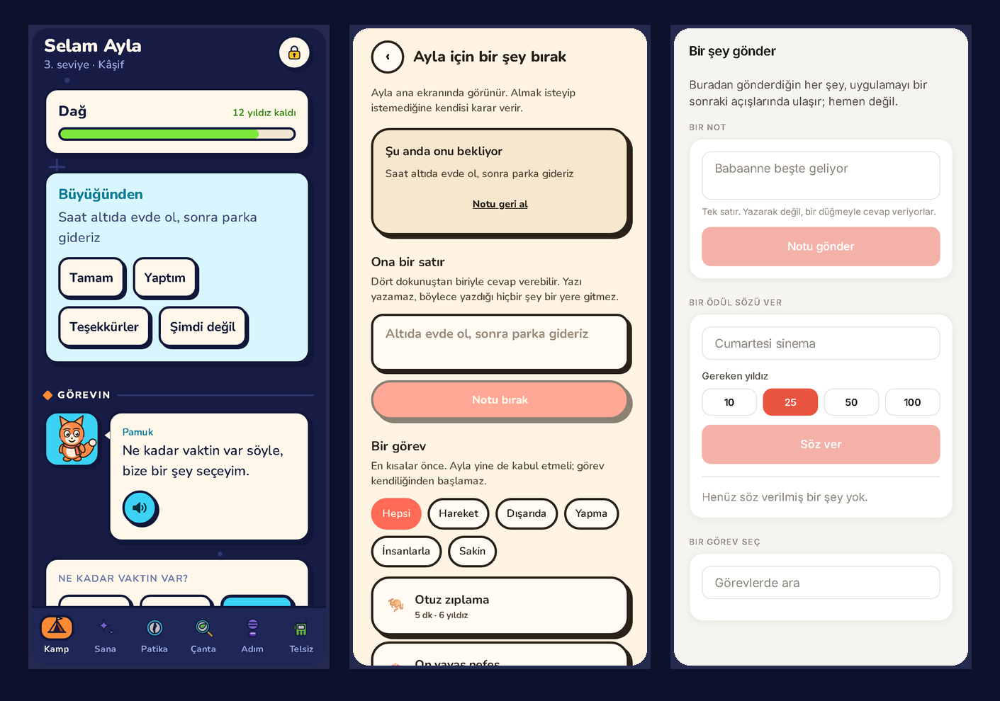
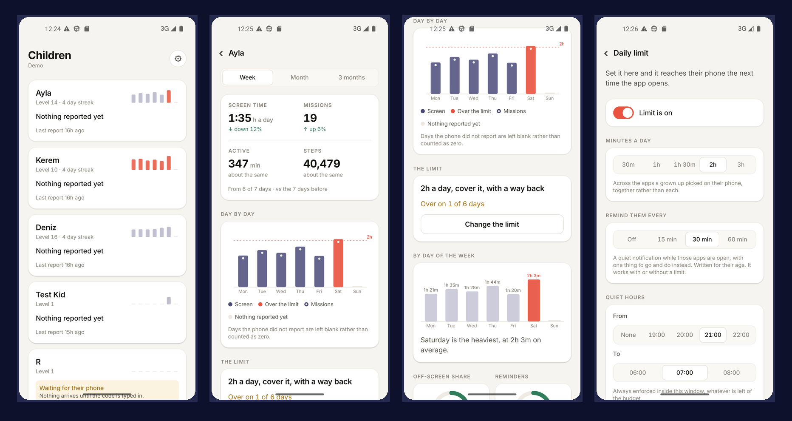

<div align="center">



<br>

Çocuğun ekran süresini ölçen, azaldıkça yerine somut bir şey koyan ve
ebeveyne kanıtıyla birlikte gösteren üç parçalı bir sistem.

**Emin Baxishli** · TEKNOFEST 2026

<br>

### Uygulamalar


### Sunucu


### Cihazda


### Test ve dil


<br>

[](https://eminbaxishli.online)

</div>

---

## Problem

Bir çocuğa "telefonu bırak" demek bir saat kazandırmaz. Ekran süresini gerçekten
azaltan şey, o bir saatin **yerine geçen** somut bir şeydir: dışarı çıkmak, bir
şey yapmak, biriyle konuşmak.

ScreenLess bunu üç parçada çözüyor. Çocuk tarafı süreyi ölçer ve yerine bir şey
önerir; ebeveyn tarafı ne olduğunu kanıtıyla gösterir; aradaki sunucu yalnızca
sayı taşır.

## Üç parça

| | Ne yapar | Nerede çalışır |
|---|---|---|
| **`screenless/`** | Çocuğun uygulaması. Yaşa göre üç ayrı arayüz, 209 görev, ekran sayacı, arkadaş, koleksiyon | Çocuğun (veya ailenin) telefonu |
| **`parent/`** | Ebeveyn paneli. Grafikler, günlük limit, mesaj, görev atama | Ebeveynin telefonu |
| **`server/`** | Hub. Bağımlılığı olmayan Node + tek SQLite dosyası | Contabo · `eminbaxishli.online` |

<br>

<div align="center">

</div>

---

## Tek telefonlu aile

**Ebeveyn uygulaması zorunlu değil.** Aile tek cihaz paylaşıyorsa — ki
çoğunluk böyle — çocuk uygulamasının veli bölümü aynı işi görür: veli kodunu
girip görev bırakır, not yazar, ödül tanımlar, limit ayarlar. Sunucu hiç
devreye girmez, hiçbir şey ağa çıkmaz.

Bağlantı kurulmamış bir telefonda kod şu şekilde davranır:

- kurulum akışının hiçbir adımı hub'dan söz etmez
- `data.hub` yalnızca bağlantı ekranı tarafından okunur
- gelen kutusu boşsa çocuğun ana ekranında hiçbir kart çizilmez
- bağlantıyı kesmek hiçbir veriyi götürmez

Bağlantı kurulduğunda da yerel olarak bırakılan bir görev veya not `source:
'local'` ile işaretlenir; sunucudan gelen bir senkronizasyon onu silemez.

---

## Çocuğun gördüğü

Yaş bandına göre **üç ayrı arayüz** var ve bunlar aynı arayüzün büyütülmüş hali
değil. Bir altı yaşındaki, beş yaşına yapılmış bir arayüzü görür görmez
reddediyor; bir on iki yaşındaki, küçük kardeşine benzeyen bir şeyi otobüste
açmıyor. Tasarımın üçe ayrılmasının sebebi bu.

**3-5 · boyanmış pastel bir dünya**, ekranda tek karar, okuma gerektirmeyen resimler

<div align="center"></div>

**6-9 · koyu lacivert üstünde bir keşif**, sert gölgeli bloklar, sayılar yazıyla

<div align="center"></div>

**10-13 · neredeyse siyah bir kayıt defteri**, ince çizgiler, tek vurgu rengi, iri rakamlar

<div align="center"></div>

<sub>Ekran görüntüleri gerçek cihazdan, İngilizce kurulumdan alınmıştır. Arayüzün tamamı Türkçe, İngilizce ve Azerbaycanca çalışır.</sub>

---

## Veliden çocuğa

Veli bir görev bırakabilir, bir satır yazabilir, bir ödül söz verebilir. Çocuk
tarafında bu, ana ekranda tek bir kart olarak çıkar ve **dört hazır cevabı**
vardır: Tamam, Yaptım, Teşekkürler, Şimdi değil.

<div align="center"></div>

Metin kutusu yok, ve bu bir eksiklik değil: çocuğun yazdığı bir cümle sunucuya
çıkardı, ki tüm senkronizasyon sözleşmesi tam olarak bunu engellemek için var.
"Şimdi değil" listede olmasının sebebi de aynı — reddetme yolu olmayan hazır
cevaplar bir cevap değil, bir makbuzdur.

Görev de metin olarak gitmiyor: sunucu yalnızca **kütüphane anahtarını**
taşıyor, başlığı ve adımları çocuğun telefonu kendi dilinde buluyor.

**Kabul etmek başlatmak değildir.** Velinin seçtiği görev çocuğun kendi görev
listesine düşer; ne zaman başlayacağına çocuk karar verir. Kendi kendine açılan
bir görev, çocuğun baktığı ekranı elinden almak olurdu.

## Ebeveynin gördüğü

<div align="center"></div>

<div align="center">
<sub><b>Çocuklar</b> · her biri için haftalık şerit &nbsp;·&nbsp; <b>Panel</b> · eğilim ve limit çizgisi &nbsp;·&nbsp; <b>Gün ve halkalar</b> · en ağır gün, ekran dışı pay &nbsp;·&nbsp; <b>Limit</b> · süre, hatırlatma, sessiz saatler</sub>
</div>

<br>

Panelin tamamı tek bir kurala dayanıyor:

> **Telefonun bildirmediği bir gün sıfır değildir.**
> Boş gün, sıfır çubuktan görünür biçimde farklı çizilir ve her ortalama kaç
> günün üzerinden alındığını söyler. Kapalı bir telefonu "iyi bir gün" diye
> gösteren bir panele hiçbir konuda güvenilmez.

Bundan çıkan iki sonuç: ortalamalar takvime göre değil **bildirim yapan güne**
göre alınır, ve eğilimler toplamı değil **günlük oranı** karşılaştırır. İkincisi
olmadan bir ailenin ikinci ayı, çocuk aynı şeyi yaptığı halde "görevler %280
arttı" diye okunuyordu.

**Hatırlatmalar da yaşa göre yazılıyor** — aynı cümlenin dakikası değiştirilmiş
hali değil:

| Yaş | Bildirim ne der |
|---|---|
| 3-5 | Arkadaşı onu özlemiştir. Sayı yok, limit yok, saat yok |
| 6-9 | Kaç dakika kaldığı, ve yerine yapılacak somut bir şey |
| 10-13 | Yalnızca rakam. Maskot yok, ünlem yok |


---

## Sunucuya ne gidiyor

Sayılar. Ekran dakikası, biten görev, yıldız, adım, görev türü, gösterilen
hatırlatma sayısı ve kaçının ardından bir göreve başlandığı.

**Gitmeyenler:** çocuğun adı, görev başlıkları, 10-13 tarafının yazdığı özel
notlar, fotoğraflar, sohbet mesajları, koleksiyon, çocuğun yazdığı veya çizdiği
hiçbir şey.

Bu bir söz değil, bir test:

```ts
// screenless/scripts/test-sync.ts
ok('no private note',   !wire.includes('sad'));
ok('no mission title',  !wire.includes('worst day'));
ok('no photo path',     !wire.includes('pictures'));
ok('no chat message',   !wire.includes('shouted'));
ok('not even the name a parent typed', !wire.includes('Ayla'));
```

Panelde görünen isim, **velinin kendi uygulamasına yazdığı** isimdir. Çocuğun
cihazı hiç isim göndermemiştir.

---

## Kurulum

```bash
cd server     && npm run seed && npm start   # hub :8099, altı haftalık demo verisi
cd parent     && npm install  && npm run web # :8082
cd screenless && npm install  && npm run web # :8081
```

Demo hesabı: `demo@screenless.app` / `screenless-demo-2026`

<sub>Bu hesap yalnızca yerelde `npm run seed` ile oluşturulan veritabanında vardır. Canlı sunucuda karşılığı yoktur.</sub>

Telefonu bağlamak: ebeveyn uygulamasında çocuk ekleyin, çıkan altı karakterli
kodu çocuğun telefonunda **Veli bölümü → Ebeveyn paneli** ekranına girin. Kod
tek kullanımlık ve yarım saat geçerli. Kod, katılacağı hesapta üretilir; tersi
olsaydı bir çocuğun telefonunu eline geçiren herkes onu kendi hesabına
bağlayabilirdi.

## Testler

```bash
cd screenless && npm run typecheck && npm run test:all   # 12 paket
cd parent     && npm run typecheck && npm run test:format
cd server     && npm test                                # 53 test, ağ yok
```

| Paket | Ne kanıtlıyor |
|---|---|
| `test-tasks` | 209 görevin tamamı, yaş bandı ve doğrulama kuralları · 7398 kontrol |
| `test-sync` | Telefondan ne çıktığı ve velinin limitlerinin ne yaptığı · 70 |
| `test-inbox` | Veliden gelenin kuralları; iki hata bu dosyayı yazdırdı · 57 |
| `test-nudge` | Hatırlatmalar ve üç dildeki metinleri · 66 |
| `test-guard` | Ekran limiti merdiveni · 70 |
| `test-chat` | Arkadaşın kendine saklaması gerekenler · 61 |

## Dağıtım

```bash
cd server && bash deploy/push.sh root@<sunucu-ip>
```

Testleri çalıştırır, dosyaları kopyalar, gerekiyorsa Node 22 kurar ve nginx
arkasında sıkılaştırılmış bir systemd birimi başlatır. Canlıdaki kurulum Caddy
kullanıyor ve TLS'i Let's Encrypt'ten alıyor.

---

## Yapı

```
childrenapp/
├── screenless/          çocuğun uygulaması
│   ├── src/app/         expo-router rotaları
│   ├── src/little/      3-5 arayüzü
│   ├── src/junior/      6-9 arayüzü
│   ├── src/teen/        10-13 arayüzü
│   ├── src/guard/       ekran limiti ve hatırlatmalar
│   ├── src/inbox/       veliden gelen görev ve not
│   ├── src/sync/        hub'a giden rapor, gelen limit
│   ├── modules/         Android UsageStats + iOS Screen Time
│   └── scripts/         12 test paketi
├── parent/              ebeveyn paneli
│   ├── src/app/         giriş, çocuklar, panel, limit, gönder
│   ├── src/components/  elle çizilmiş SVG grafikler
│   └── src/lib/         panelin gösterdiği her sayı, saf ve test edilmiş
├── server/              hub
│   ├── src/app.js       her uç nokta, çerçevesiz
│   ├── src/rules.js     neyin saklanabileceği, neyin sessizce atıldığı
│   └── deploy/          systemd, nginx, install.sh
└── tools/               README görselleri ve ekran görüntüleri
```

---

<div align="center">
<sub>ScreenLess · TEKNOFEST 2026 · <a href="https://eminbaxishli.online">eminbaxishli.online</a></sub>
</div>
